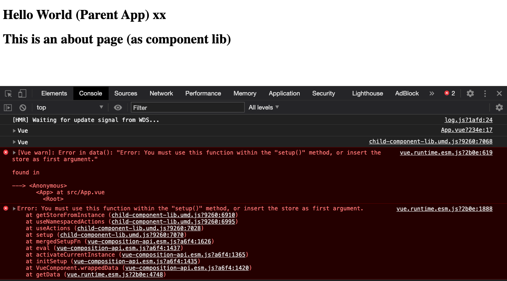

# vue-composition-api-comp-lib
Testing import of @vue/composition-api style components from a component library

## Reproduce the error

### 1. Clone, install, run
```bash
git clone git@github.com:tholst/vue-composition-api-comp-lib.git && cd vue-composition-api-comp-lib/child-component-lib && npm install && npm run build && cd ../parent-app/ && npm install && npm run serve
```

or one by one 
```
git clone git@github.com:tholst/vue-composition-api-comp-lib.git
cd vue-composition-api-comp-lib/child-component-lib
npm install
npm run build
cd ../parent-app/
npm install
npm run serve
```

### 2. Open Browser

- Go to http://localhost:8080/

### 3. Open Dev Tools to See Error

```
[Vue warn]: Error in data(): "Error: You must use this function within the "setup()" method, or insert the store as first argument."

found in

---> <Anonymous>
       <App> at src/App.vue
         <Root>
```



